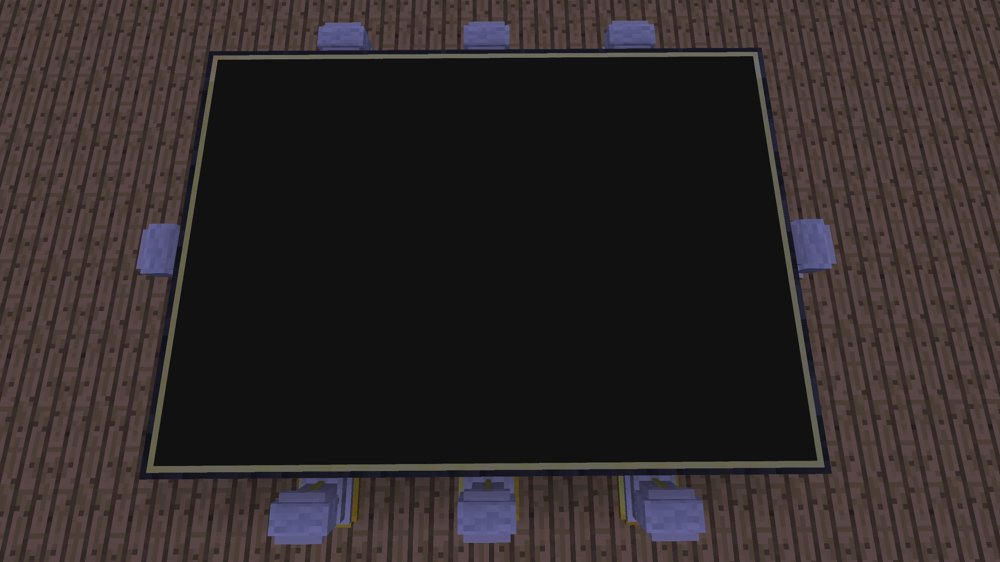

# CCPoker
Poker in ComputerCraft, still a work in progress

## Dependencies
 - Designed to run in FTB Revelation
 - Surface (Download https://pastebin.com/UxweEuqf as surface)
 - json (Download https://raw.githubusercontent.com/DataDink/ComputerCraft/master/Libraries/json.lua as json)

## Easy Checkout
 - Download https://pastebin.com/U8TFs3cM as github
 - Run `github clone Mirosta CCPoker`
 - To download updates cd to CCPoker and run `github update`
 
## Minecraft Setup

### Poker Table
Items:
 - Computer
 - Advanced Monitor 7x5
 - Wired Modem
 - Wireless Modem
 - Pedestal (Reliquary) x8
 
Place the monitors facing upwards, 7 wide by 5 high. Place the computer adjacent to one of the monitors, and attach both modems.
The wireless modem is meant to communicate to the players' pocket computers while the wired modem enables cheap communcation to turtles that manage the pedestals (currently a work in progress).

Place a pedestal in the middle of the shorter left and right sides, place a pedestal in the middle of the longer top and bottom sides, as well as one each to the left and right with a one block separation.

On the computer cd to CCPoker and run poker.lua

## Poker Client
Items:
 - Advanced Wireless Pocket Computer

Install as with the table computer, then cd to CCPoker and run pokerClient.lua.
